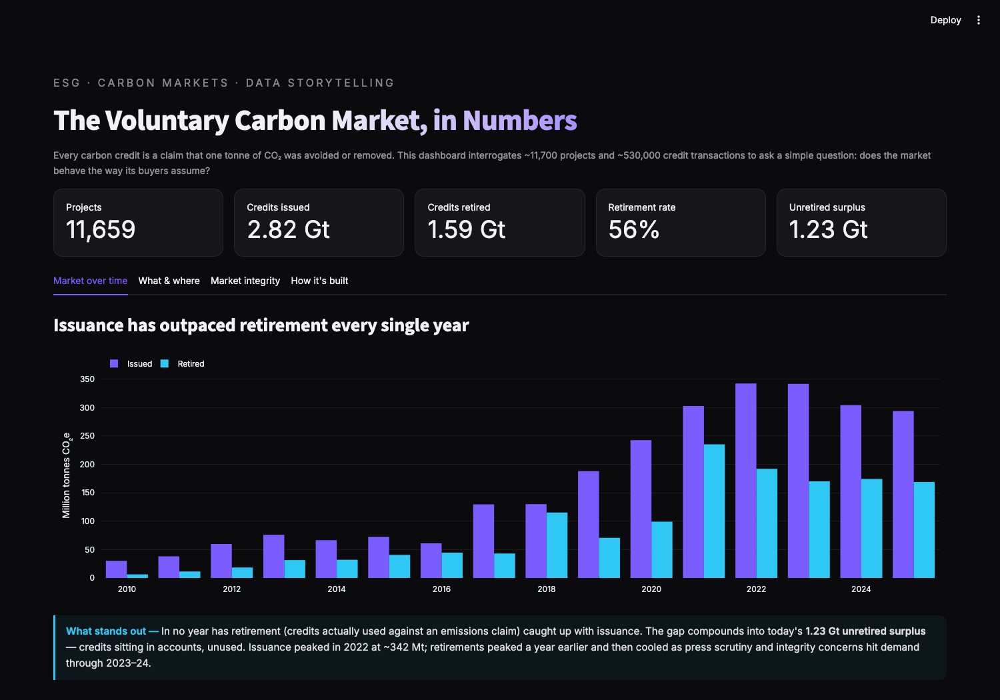

# Voluntary Carbon Market Analytics

**A data-storytelling dashboard on how the voluntary carbon market actually behaves — ~11,700 projects and ~530,000 credit transactions across seven registries.**

**Live demo: https://drishtant-carbon-market.streamlit.app**

Every carbon credit is a claim that one tonne of CO₂ was avoided or removed. This dashboard interrogates the public record to ask whether the market behaves the way its buyers assume — and finds a persistent gap between credits issued and credits actually used.



## The findings

- **A 1.23 Gt unretired surplus.** Issuance has outpaced retirement *every year on record*; only 56% of all credits ever issued have been retired against an emissions claim. The rest sit unused in accounts.
- **A boom and a cooling.** Issuance peaked at ~342 Mt in 2022; retirements peaked a year earlier and then fell as integrity scrutiny hit demand through 2023–24.
- **Heavy concentration.** Two project types — forestry & land use and renewable energy — are roughly two-thirds of all credits issued, and Verra alone has issued more than half. Engineered carbon *removal* (biomass, mineralization, direct air capture) is still under 0.3 Mt combined — a rounding error against the 2.8 Gt legacy market.
- **Recognisable buyers.** Oil majors and airlines lead retirements (Shell, Eni, Delta, Volkswagen). One leaderboard entry is a crypto bridge, not an end buyer — a reminder that a retirement record is not always a climate claim.

## How it's built

```
prep_data.py  →  downloads the raw CarbonPlan OffsetsDB (~65 MB, ~530k rows),
                 harmonises registry/category labels and beneficiary names,
                 and aggregates everything into small CSV artifacts (<2 KB each)
app.py        →  reads only those artifacts and tells the story with Plotly —
                 so the app loads instantly and deploys on free hosting
```

The heavy lifting happens once, in the reproducible pipeline — never on the request path. Refresh every figure from the latest published snapshot with:

```bash
python prep_data.py --download
```

## Data

[**CarbonPlan OffsetsDB**](https://carbonplan.org/research/offsets-db) — a harmonised snapshot of seven voluntary offset registries: American Carbon Registry, ART TREES, Cercarbono, Climate Action Reserve, Gold Standard, Isometric and Verra. The data is purely factual registry information; CarbonPlan claims no copyright and provides it as-is. The small aggregated artifacts are committed under [`data/`](data/); the raw archive is fetched by the prep script.

## Run it locally

```bash
git clone https://github.com/drishtantleuva/carbon-market-analytics.git
cd carbon-market-analytics
python3 -m venv venv && source venv/bin/activate
pip install -r requirements.txt
streamlit run app.py          # uses the committed artifacts
```

## Caveats

Retirement rate is a proxy for demand and trust, not a quality verdict on any project — recently issued credits haven't had time to retire. Registry data is self-reported and uneven; some beneficiary names remain un-harmonised. Figures reflect the loaded snapshot, not a live feed. These are stated in the dashboard's "How it's built" tab rather than hidden.

---

Built by **Drishtant Leuva** — Data Scientist specialising in risk analytics, explainable AI and ESG. Master's research and a Springer book chapter on verifying UN SDG claims in carbon-credit projects.
[LinkedIn](https://www.linkedin.com/in/drishtant-leuva/) · drishtantl@gmail.com
